# Laya Record-Normalisation PoC: Design, Plan and Implementation

| | |
|---|---|
| Version | 1.0 |
| Date | 25 September 2026 |
| Document owner | Lead Data Scientist (placeholder) |
| Status | Approved for execution, pending legal sign-off for gated data access |

This document specifies a two-week proof of concept that fine-tunes the open-source Laya decision model on public Foursquare place records and decides, against fixed thresholds, whether Laya beats cheap baselines at normalising messy multi-field records into one label from a small closed taxonomy.

## TL;DR

- We fine-tune `convaiinnovations/laya` and `convaiinnovations/laya-multilingual` to predict a place's level-1 category (10 classes, plus a 7-class variant) from its sparse, multi-source fields. We compare them with TF-IDF+LR, a fine-tuned small encoder and zero-shot runs on identical in-distribution, out-of-distribution (OOD) and trap splits.
- The smoke test and the first real run use the free Colab T4. Only once the gate passes (end-to-end run, no NaNs, within 5 macro-F1 points of TF-IDF+LR) does the seed matrix move to a Colab L4 or a rented A10, and it moves again whenever we go to longer or wider records. Total cash cost is expected to be under about $60.
- Laya passes only if it beats both trained baselines by ≥3 macro-F1 points on OOD, keeps the ID→OOD gap ≤5 points, reaches post-temperature ECE ≤0.05, matches the best baseline on traps, and meets a CPU budget of p95 ≤500 ms per record on 4 vCPUs. Effort is about 6.5–7 person-days (8.5–9.5 with the GLEIF variant).

---

## 1. Summary

**Problem.** Records are assembled from several sources, each with its own vocabulary. Most fields are empty, some conflict or are stale, and new values appear all the time. Each record must be normalised to exactly one label from a small closed set. The answer must be consistent, the confidence calibrated, the model must abstain when there is no evidence, and inference must run on CPU.

**Goal.** Find out whether a fine-tuned Laya model does this reliably, and better than cheap, well-understood baselines, using public proxy data only. The result informs whether Laya is worth trialling on a similar internal record-normalisation problem (out of scope for this document).

**Approach.** Our proxy is Foursquare Open Source Places (FSQ OS Places). The task is to predict the level-1 category from name, address, contact and social fields, with every category-derived field removed. Records are serialised as compact JSON and posed as one Laya `choice` question. We train full fine-tunes of both checkpoints over three seeds each and calibrate one temperature on validation. We then evaluate accuracy, OOD robustness, trap items, calibration, abstention, stability and CPU latency. GLEIF LEI data is the backup proxy (Appendix C).

**Hardware plan.** Smoke test and first real run on the free Colab T4. At the gate, switch to a Colab L4 or a rented A10 for the seed matrix, and whenever records get longer or wider.

**Decision rule.** See §5.12. Every threshold is fixed before any results are seen.

**Timeline.** Seven working days for FSQ, plus two optional days for GLEIF (§6).

## 2. Problem statement, goal and scope

### 2.1 Problem characteristics the proxy must exercise

1. **Many vocabularies for one concept.** Different sources, languages and regions describe the same class in different words.
2. **Sparsity.** Most fields are empty in most records. A missing field is not evidence of anything.
3. **Conflicting or stale fields.** Two fields can point to different classes.
4. **Long tail.** New names, brands and codes keep appearing that were never seen in training.
5. **Look-alike strings.** A token strongly associated with one class can appear in a record of another ("Hospital Road Café").
6. **Local conventions.** Some source- or region-specific formats carry signal only if the model knows them.
7. **Output requirements.** Exactly one label from a closed set, consistent answers for the same content, calibrated confidence, abstention when there is no evidence, and CPU inference.

### 2.2 Success criteria

The PoC succeeds if it produces a clear, defensible pass, investigate or stop verdict under §5.12, with every number reproducible from pinned code, pinned data release and logged seeds. A "stop" verdict with clean evidence counts as success.

### 2.3 In scope

- FSQ OS Places (primary) and GLEIF Golden Copy (optional backup), both public.
- Laya full fine-tuning, a head-only lower bound, baselines, calibration, evaluation and CPU/ONNX benchmarking.
- Free Colab T4, Colab L4 or a rented A10, and a local CPU laptop.

### 2.4 Out of scope

- The internal target problem and its data. No internal data goes to Colab, Kaggle or rented machines at any point.
- Serving, integration, or any production decision.
- Model families other than Laya, except as baselines.

## 3. Background

### 3.1 What Laya is

Laya (repo `NandhaKishorM/laya`, Apache-2.0, `pip install laya`) is a non-autoregressive decision model. It takes a **state** (text or a JSON document) and typed **questions** (`choice`, `score`, `noul`), and returns probabilities for each question from a single forward pass. Options are defined per request in the question's `criteria` dictionary, so there is no fixed output layer to retrain.

The README describes release 0.3.20. It requires Python ≥3.10, and the dependency floor is `huggingface_hub` 1.x, `transformers` 5.x and `torch` 2.14. Optional extras include `laya[onnx]` (ONNX Runtime) and `laya[fast]` (a TileLang GPU path we do not use).

| Checkpoint | Encoder | Params | Context | Option budget `head_max_len` |
|---|---|---|---|---|
| `convaiinnovations/laya` | ModernBERT-large | 421M | 512 | 192 |
| `convaiinnovations/laya-multilingual` | mmBERT-base | 322M | 1,024 (up to 8,192) | 256 |
| `convaiinnovations/laya-typed-decisions` | ModernBERT-large | 421M | 1,024 | 256 |

**Architecture.** The encoder is fully fine-tuned. On top sits a decision head trained from scratch: two transformer layers, an option-marker scorer that reads one `[MASK]` per option, and an act/escalate head. The input sequence is split into a state budget (`max_len − head_max_len`, about 320 tokens on `laya`) and an option budget shared by all options, roughly `(head_max_len − 16) // n_options` tokens each.

**Training objective in practice.** Issue #238 reviews the official notebook's training loop:
- `gold["probabilities"]` becomes the target;
- the loss is soft-target cross-entropy plus a REINFORCE-style term;
- that term uses Gaussian noise on the logits, a `proper_reward` (log plus spherical scoring rule, plus RPS for ordinal questions) computed under `no_grad`, a group baseline over four samples, and advantages normalised across the batch.

One-hot or label-smoothed targets fit this objective directly.

**Checkpoint files.** A checkpoint directory holds `model.safetensors`, `encoder/`, `tokenizer/` and `rl_agent_config.json`. The config carries `max_len`, `head_max_len`, `temperature` (per type, in the order choice, score, noul) and optionally `temperature_by_options` (bucket keys such as `"noul:2"`). At load time the runtime clamps temperatures to [0.5, 5.0]. The raw values stay available in `agent.temperature_raw` and `agent.temperature_by_options_raw`.

**Inference API used here.**
- `laya.load(repo_or_dir, subfolder=...)` returns an `Agent`.
- `agent.predict(state, questions)` handles one state; `agent.predict_batch(states, questions, batch_size=..., sort_by_length=True)` handles many.
- Each answer carries `choice`, per-option probabilities, `confidence` and `answer_confidence`:
  - `confidence` is 1 minus normalised entropy, which measures how concentrated the distribution is. It is not a probability.
  - `answer_confidence` is the probability of the reported answer. **We gate on `answer_confidence`.**
- `LAYA_THREADS` caps torch intra-op threads on CPU; keep it at or below the number of physical cores.
- `ONNXAgent` comes from `laya[onnx]`.
- A cold checkpoint build takes seconds; the README measured a 7.4 s median reload on CPU. Preloaded CPU latency is quoted as "193–464 ms", depending on hardware.

**Known behaviour we must design around.**

| Ref | Behaviour | Our handling |
|---|---|---|
| README | Base checkpoints score near chance zero-shot on typed-decisions (0.362 and 0.352; the fine-tuned checkpoint scores 0.766) | Fine-tuning is the treatment; zero-shot is only a baseline |
| README | Collapse on more than about 20 options (Banking77: 0.425) | 10 or 7 options only |
| README | Boolean words as `choice` labels get followed instead of the descriptions | Semantic, non-boolean keys |
| #377 | Negation is unreliable | Not needed for this task; noted |
| #156 | `noul` follows its label text | We do not use `noul` |
| #131 | `laya-multilingual` position bias on `score` | We do not use `score` |
| #185 | `action.act_probability` carries no signal | Ignored; gate on `answer_confidence` |
| #148/#149 | `head_checkpointing` used to be ignored; fixed | Pin a commit that includes #149 |
| #186/#191 | Temperatures used to be fitted on a training slice; fixed with a held-out slice | We refit on our validation split only |
| #443 | bf16 autocast is up to 0.073 from fp32; fp16 is within 0.019 | fp16 on every card |
| #450 | Accuracy drops on longer states | Token-length asserts and logging |
| README | Overlong input is truncated silently | Reject or compress before the model sees it |
| typed-decisions card | Shipped temperatures were fitted on training data | Treat that checkpoint as uncalibrated; not used as a start point |

### 3.2 Why Laya is a candidate

Laya matches the output contract we need: a closed option set supplied at request time, calibrated probabilities from proper-scoring-rule training, a single forward pass, and a documented CPU and ONNX path. It is Apache-2.0 and fine-tunable on free hardware. An independent study (Anthus, anth.us/blog/jev-vs-laya) found full fine-tuning on 140 labels reached 0.896 accuracy, against 0.835 for fine-tuned DistilBERT, 0.722 for untuned Laya and 0.659 for a head-only fine-tune. We therefore budget for full fine-tuning and treat head-only as a cheap lower bound.

## 4. Proxy data

### 4.1 FSQ OS Places

- **Location:** `huggingface.co/datasets/foursquare/fsq-os-places`. Apache-2.0, with NOTICE attribution.
- **Releases** are monthly. The dataset card currently configures `release/dt=2026-08-11` with `places`, `categories` and `deltas` subsets. VERIFY the newest release on the card's Files tab on Day 1 and pin it in `config.yaml`.
- **Layout:** `release/dt=<DATE>/places/parquet/*.parquet` and `release/dt=<DATE>/categories/parquet/*.parquet`.
- **Size:** 100M+ places. The 2024-11-19 release had 104,511,073.

**Access is gated.** The requester supplies Organisation, Title, Country and an intended use (Research / Education / Commercial), and must tick a clause agreeing that (a) they accept on behalf of their organisation and (b) the repository authors may use "your employer or entity name and logo in descriptions of its partners on its website, in media, and in marketing materials". **Nobody requests access until Legal/Compliance has signed off in writing** (task P0.1). If sign-off is refused, switch to the GLEIF variant, which is CC0 and ungated, as the primary.

**Places columns** (from the Foursquare "Places OS Data Schemas" page):
- identity: `fsq_place_id`, `name`;
- location: `latitude`, `longitude`, `address`, `locality`, `region`, `postcode`, `admin_region`, `post_town`, `po_box`, `country`;
- dates: `date_created`, `date_refreshed`, `date_closed`;
- contact and social: `tel`, `website`, `email`, `facebook_id`, `instagram`, `twitter`;
- categories: `fsq_category_ids`, `fsq_category_labels` (arrays);
- other: `placemaker_url`, `unresolved_flags` (array), `geom` (WKB), `bbox` (struct).

The full dictionary is in Appendix A.

**Categories columns:** `category_id`, `category_level` (1–6), `category_name`, `category_label` (breadcrumb joined with `>`), and `level1_category_id`/`level1_category_name` through `level6_category_id`/`level6_category_name`.

**Level-1 categories (10):** Arts and Entertainment; Business and Professional Services; Community and Government; Dining and Drinking; Event; Health and Medicine; Landmarks and Outdoors; Retail; Sports and Recreation; Travel and Transportation. VERIFY the exact strings with the query in §7.4.2; some third-party documentation writes "Events".

### 4.2 Why it mirrors the generic problem

- Place records are assembled from user input, crawls and third parties. Each source uses its own vocabulary, language and format, which covers characteristics 1, 3 and 6 in §2.1.
- Most optional fields are empty (2), chains and new venues form a long tail (4), and category words often appear out of sense in names and street addresses (5).
- The label set is closed and small, and labels are defined independently of the input fields.

## 5. Design

### 5.1 Pipeline architecture

```mermaid
flowchart LR
  A[FSQ parquet on HF<br/>pinned release] -->|DuckDB hf:// + token| B[Extract & label<br/>level-1 via categories join]
  B --> C[Leakage removal<br/>closed/flagged filter]
  C --> D[Dedup + splits<br/>ID / OOD-country / OOD-script / OOD-brand / trap]
  D --> E[Serialise<br/>compact JSON, token check]
  E --> F[Questions + gold<br/>typed-decisions format]
  F --> G[Train-only augmentation<br/>dropout, stripped, conflicts]
  G --> H[Fine-tune Laya<br/>fp16, resumable]
  H --> I[Temperature fit<br/>validation only]
  I --> J[Evaluation harness<br/>metrics, traps, OOD, stability]
  J --> K[CPU benchmark<br/>PyTorch vs ONNX]
  D --> L[Baselines<br/>TF-IDF+LR, small encoder, zero-shot, head-only]
  L --> J
  K --> M[Decision rule §5.12]
  J --> M
```



### 5.2 Label design

**Label source.** For each place we join every ID in `fsq_category_ids` to `categories.category_id` and take `level1_category_name`. A place keeps its label only if all of its categories share one level-1 name. Places with mixed level-1 names are excluded from training and evaluation, and a sample of them feeds the trap set (§5.3).

**10-class keys.** Descriptions are ≤10 tokens. Keys are short, semantic and never `yes`/`no`/`true`/`false`/`other`.

| Key | Level-1 name | Description (≤10 tokens) |
|---|---|---|
| `arts` | Arts and Entertainment | museums, theatres, cinemas, galleries, music venues |
| `services` | Business and Professional Services | offices, trades, repairs, agencies, professional services |
| `community` | Community and Government | schools, worship, government offices, civic facilities |
| `dining` | Dining and Drinking | restaurants, cafés, bars, bakeries, takeaways |
| `event` | Event | festivals, markets, conferences, temporary events |
| `health` | Health and Medicine | clinics, dentists, pharmacies, hospitals, therapists |
| `outdoors` | Landmarks and Outdoors | parks, beaches, monuments, natural features, squares |
| `retail` | Retail | shops, supermarkets, boutiques, stores |
| `sports` | Sports and Recreation | gyms, pitches, pools, sports clubs, leisure centres |
| `travel` | Travel and Transportation | hotels, stations, airports, car parks, transport |

**7-class collapse.** We keep the three proposed merges, having checked them against the verified names:

| 7-class key | Merges | Rationale |
|---|---|---|
| `culture` | Arts and Entertainment + Event | Event is a tiny, transient class. The FSQ card lists "Event" among its non-commercial categories, and most event venues read as entertainment |
| `leisure` | Sports and Recreation + Landmarks and Outdoors | The heaviest look-alike pair in practice (parks, pitches, trails, beaches) |
| `civic_services` | Community and Government + Business and Professional Services | Both are "organisation" records dominated by generic names and addresses |
| `dining`, `retail`, `health`, `travel` | unchanged | Distinct vocabularies |

If the §7.4.2 query shows Event has fewer than 300 labelled places in the ID pool, Event is reported but excluded from the 10-class macro-F1 headline and a 9-class macro-F1 is used instead. The macro-F1 would otherwise be dominated by a class too small to measure; the adjustment is logged.

**Gold targets.** These use the typed-decisions `gold` format. Each question carries a full probability dictionary over all options, either one-hot or label-smoothed (0.9 on the true class, 0.1 spread evenly over the rest). The default is smoothed; one-hot is an ablation in the smoke test only.

### 5.3 Splits

All sampling is seeded (`split_seed: 20260925`).

| Split | Source | Size | Composition |
|---|---|---|---|
| `train` | ID pool: GB, US, DE, FR, ES, IT, BR, IN, JP, ID | ≈25,000 | Stratified; cap 3,000 per class (smaller classes take all available up to the cap); roughly balanced across countries |
| `val` | ID pool | 3,000 | Natural class prevalence |
| `test_id` | ID pool | 3,000 | Natural prevalence |
| `ood_country` | NL, PL, MX (seen scripts) | 2,000 | Natural prevalence, about 667 per country |
| `ood_script` | TH | 2,000 | Natural prevalence |
| `ood_brand` | ID pool rows whose normalised name is in the top-200 brand list | 2,000 | Natural prevalence |
| `trap` | ID pool plus OOD pools, manually verified | 150–300 | Look-alikes and multi-category brands |
| `stripped_test` | Copies of 1,000 `test_id` rows with every field but `country` removed | 1,000 | For the no-evidence metrics |

**Why Thailand for the unseen script.** Turkish uses Latin script, so TR would test a new language rather than a new script. Thai script appears nowhere in the ID pool, whereas Japanese appears via JP. mmBERT covers Thai, and FSQ has dense coverage there (VERIFY the row count in §7.4.2; fall back to KR if TH has fewer than 20,000 eligible rows). This split will show the English `laya` checkpoint collapsing, which the README documents for non-Latin scripts. That is an expected result and itself a finding.

**Brand holdout.** Normalise names (lower-case, NFKC, strip punctuation and legal suffixes, collapse whitespace), then count across the whole ID pool. The top 200 normalised names by frequency are removed from **all** training, validation and `test_id` rows; their rows form `ood_brand`.

**Dedup rules.**
1. No `(norm_name, norm_locality, country)` key may appear in more than one split.
2. Within `train`, keep at most 5 rows per `(norm_name, country)`, so chains cannot dominate.
3. The brand holdout is enforced by assertion.

**Trap set construction.** Items come from real rows, not invented ones.
1. Run the name-pattern queries in §7.4.5. Examples: names containing hospital/clinic/pharmacy whose label is not `health`; bank/church/school/museum/park words where the label differs from the word's usual class; and places with mixed level-1 categories (multi-category brands).
2. Sample about 600 candidates, stratified by pattern.
3. Two annotators independently check each candidate against its fields and the FSQ label. They keep an item only if the FSQ level-1 label is plausibly correct and the name misleads. Disagreements go to the lead.
4. For multi-category brands, the gold is the level-1 of the first listed category, and the item is flagged `multi=1` so it can be reported separately.
5. The target is 150–300 kept items. Trap items are removed from every other split before training.

### 5.4 Leakage removal

- **Drop:** `fsq_category_ids`, `fsq_category_labels`, and any column derived from categories.
- **Drop:** `fsq_place_id`, `placemaker_url`, `latitude`, `longitude`, `geom`, `bbox`, `date_created`, `date_refreshed`.
- **Filter out:** rows where `date_closed` is set, and rows whose `unresolved_flags` contain `closed`, `doesnt_exist`, `delete` or `duplicate`.
- **Assert:** no serialised record contains a level-1 or level-2 category name as a JSON key, and no category ID string appears in any record.
- **Names carry category words** ("Joe's Pizza"). That is legitimate signal and is kept. We report the share of `test_id` rows whose name contains the label's own key words, and give per-class metrics on the subset without such words.

### 5.5 Serialisation

- Compact JSON (`separators=(",", ":")`) with the original field names kept and nulls and empty strings omitted.
- Field order is shuffled per epoch in training. It is fixed (alphabetical) in evaluation, except in the order-invariance test.
- Light normalisation only: strip `http://`, `https://` and `www.` from `website`, collapse whitespace, trim.
- Token check: `len(tokenise(state)) ≤ max_len − head_max_len − 8` (safety margin of 8), i.e. about 312 tokens on `laya` at 512/192 and 248 on `laya-multilingual` at 512/256. Overlong records are compressed in order: drop `twitter`, `instagram`, `facebook_id`, `email`, then truncate `address` to 120 characters. If still too long, the record is rejected. Counts per split are logged. A rejection rate above 0.5% blocks training until reviewed.

### 5.6 Question definition

```json
{"place_category": {"type": "choice",
  "instructions": "Which category best describes this place record?",
  "criteria": {"arts": "museums, theatres, cinemas, galleries, music venues", "...": "..."}}}
```

With 10 options on `laya`, each option gets `(192−16)//10 = 17` tokens, and every description is ≤10 tokens, so nothing is trimmed. The same question object, with the same key order, is used everywhere.

### 5.7 Augmentation (train only)

| Augmentation | Rate | Target |
|---|---|---|
| Field dropout per non-name field | p = 0.4 (search 0.3/0.5 in the smoke test) | True label |
| Name dropout | 10% of records | True label |
| Evidence-stripped (keep `country` only) | 7% of records added as extra copies | Uniform soft target over all options |
| Injected conflict: one non-name field copied from a random record of a different class | 5% | True label |

Augmentation is regenerated each epoch from `epoch_seed = seed*1000 + epoch`, so it is reproducible and resumable.

### 5.8 No-evidence handling

1. **Deterministic gate, before the model.** After normalisation, if none of `name`, `address`, `locality`, `region`, `postcode`, `tel`, `website`, `email`, `facebook_id`, `instagram`, `twitter` has a value, return `{"label": null, "abstain": true, "reason": "no_evidence"}` with no forward pass. `country` alone is not evidence.
2. **Confidence threshold.** Abstain if `answer_confidence < τ`. τ is chosen on `val` as the smallest threshold that gives ≥95% accuracy on the answered set. If that leaves coverage below 70%, use the threshold for 80% coverage instead and report both.

### 5.9 Training design

| Parameter | Value |
|---|---|
| Process | Single process, single GPU; no torchrun, NCCL or two-T4 assertion |
| Start checkpoints | `laya` (512/192); `laya-multilingual` (`max_len` 512, `head_max_len` 256) |
| Precision | fp16 autocast + `GradScaler` on every card (#443) |
| Checkpointing | Encoder gradient checkpointing + `model.head_checkpointing = True` on T4; off on L4/A10 if memory allows |
| Optimiser | AdamW; lr 2e-5 (encoder), 1e-4 (head and other new parameters); weight decay 0.01 (none on biases and norms) |
| Schedule | Linear warm-up over 6% of optimiser steps, then linear decay to 0 |
| Epochs | 4 (3 for the learning-curve arm at 30k) |
| Effective batch | 32 |
| Sampler | Length-bucketed: sort within chunks of 50 × micro-batch by token length, shuffle batches |
| Evaluation | Every 250 optimiser steps (8,000 examples) on `val` macro-F1 |
| Early stopping | Patience 3 evaluations, min Δ = 0.002; keep best |
| Loss | The notebook's objective: soft-target CE + noisy proper-score REINFORCE term (§7.6.3) |
| Seeds | 3 per main arm: 11, 22, 33 |

**Runtime estimate** (to be confirmed in the smoke test). About 1–2.5 T4-hours per arm for 25k records × 4 epochs at ≤256 real tokens, and roughly 2–3× faster on L4/A10. For scale, the README quotes "roughly 4-5 hours for 4 epochs over ~30k questions" on 2×T4 at 1,024 tokens. Our sequences are much shorter.

**Attention on the T4.** The T4 is Turing and cannot run FlashAttention-2, so ModernBERT runs on SDPA. Unpadded, padding-free training needs FA2, which is why we bucket by length.
- transformers #49106 concerns custom 4D masks under sdpa/eager and ModernBERT's local-window attention, so a parity check (§7.7) is mandatory before any training.
- transformers #35879, where older versions crashed without FA, predates the pinned 5.x.

### 5.10 Calibration

- Fit one temperature per (question type, option count), i.e. `choice:10` or `choice:7`, on `val` only, using LBFGS on NLL.
- Write it into `rl_agent_config.json` as `temperature_by_options["choice:<n>"]`, and also into `temperature[0]` (choice).
- Delete every other inherited `temperature_by_options` entry.
- Temperatures outside [0.5, 5.0] get clamped at load time. If that happens, report it, because it signals a mis-specified model.

### 5.11 Evaluation design

| Area | Metric |
|---|---|
| Accuracy | Macro-F1 (headline), accuracy, per-class P/R/F1, confusion matrix with the look-alike pairs broken out: dining↔arts, sports↔outdoors, services↔community, retail↔services |
| Traps | Accuracy on `trap`, with `multi` items split out |
| OOD | Gap = macro-F1(`test_id`) − macro-F1(pool), for each OOD pool |
| Calibration | ECE (15 equal-width bins on `answer_confidence`), Brier (multi-class), NLL; before and after temperature; ID and each OOD pool |
| Selective | Risk–coverage curve; accuracy at 80% and 90% coverage |
| No evidence | On `stripped_test`: abstention rate at τ; false-confident rate = share with `answer_confidence` > 0.8 |
| Stability | Mean ± range over 3 seeds of macro-F1 and ECE; prediction flip rate across seeds; field-order invariance ≥99% |
| CPU | PyTorch CPU vs ONNX; threads 1/2/4/8; p50/p95 at batch 1; batched throughput; cold start; peak RAM; on a 4–8-core cloud CPU and an 8/16 GB laptop |

Bootstrap 95% confidence intervals (1,000 resamples) are reported for macro-F1 differences between Laya and each baseline on each pool.

### 5.12 Decision rule

Laya **passes** only if all of these hold for at least one fine-tuned checkpoint, as a mean over 3 seeds:

1. On OOD, it beats both char TF-IDF+LR and the fine-tuned small encoder by ≥3 macro-F1 points, averaged over the three OOD pools. For `laya`, `ood_script` is excluded and noted, because it cannot read Thai by design.
2. The ID→OOD gap is ≤5 points on each included pool.
3. Post-temperature ECE is ≤0.05 on `test_id` and on the OOD average.
4. Trap accuracy is at least that of the best baseline.
5. It meets the CPU budget on 4 vCPUs (fp32, whichever of ONNX or PyTorch is faster; `LAYA_THREADS=4`):
   - single-record p95 ≤500 ms at batch 1;
   - batched throughput ≥8 records/s with `predict_batch(sort_by_length=True, batch_size=32)`.

The budget is derived from the README's "193–464 ms" preloaded CPU figure. Our records are short, one question each, so 500 ms p95 sits just above the published upper end. The throughput floor assumes batching recovers at least a modest multiple over single calls. The project lead may tighten either threshold before Phase 3. Throughput relative to the small-encoder baseline is always reported.

**Stop** if:
- Laya is below both trained baselines on ID and OOD after the seed matrix; or
- post-temperature ECE exceeds 0.10; or
- p95 exceeds 1,000 ms even with ONNX on 8 threads.

**Investigate** (one bounded iteration of at most 2 days, then re-decide) if:
- Laya passes on accuracy but misses a single criterion by less than half its margin (for example ECE 0.05–0.075, or a +1.5–3 point OOD lead);
- seed variance exceeds 3 points;
- the gate failed once and a clear bug was fixed.

**What a pass does not show.** A pass on public place data does not establish performance on the eventual target data. Before any internal trial we would need:
- a label-quality audit and a baseline re-run on a sample of the target data, inside the internal environment;
- a check that token lengths and field widths fit the state budget, or a re-run on L4/A10 at a longer `max_len`;
- a re-test of OOD and trap behaviour with target-specific look-alikes;
- a threshold re-fit and a calibration check on target validation data;
- a CPU benchmark on the intended CPU hardware.

### 5.13 Baselines

All baselines use identical splits and serialisation.
1. Majority class; prior-only (predict the train prior as the distribution).
2. Zero-shot Laya, both checkpoints, same question.
3. Char 2–5-gram TF-IDF (`char_wb`) + logistic regression on the serialised JSON, with `class_weight="balanced"` and temperature scaling on `val`.
4. Fine-tuned small encoder with a softmax head: `answerdotai/ModernBERT-base` for English and `jhu-clsp/mmBERT-small` for multilingual (VERIFY the Hub ID; the fallback is `BAAI/bge-small-en-v1.5` for EN only). 3 epochs, 3 seeds, temperature-scaled.
5. Head-only Laya (frozen encoder): 1 seed, or 3 if under 30 minutes each.
6. Optional reference LLM baseline: a small zero-shot instruction-tuned model (Qwen3-4B), with constrained choice by label log-likelihood, on a 2,000-item subset of `test_id` and each OOD pool.

### 5.14 Experiment matrix

| ID | Arm | Seeds | Data | Hardware | Est. GPU-h (T4-equivalent) |
|---|---|---|---|---|---|
| E0 | Smoke test | 1 | 2k | Free T4 | 0.5 |
| E1 | `laya` first real run | 1 (seed 11) | 25k × 4 ep | Free T4 | 1–2.5 |
| E2 | `laya` | +2 (22, 33) | 25k | L4/A10 | 2–5 |
| E3 | `laya-multilingual` | 3 | 25k | L4/A10 | 2–5 |
| E4 | Head-only `laya` | 1–3 | 25k | L4/A10 | 0.5–1 |
| E5 | 7-class, both checkpoints | 1 each | 25k | L4/A10 | 2–4 |
| E6 | Learning curve `laya` | 1 | 1k/3k/10k/30k | L4/A10 | 2–3 |
| B1 | Majority / prior | – | – | CPU | 0 |
| B2 | Zero-shot, both | – | – | T4 | 0.3 |
| B3 | TF-IDF+LR (10- and 7-class) | – | – | CPU | 0 |
| B4 | ModernBERT-base, mmBERT-small | 3 each | 25k × 3 ep | L4/A10 | 2–4 |
| B5 | Reference LLM (optional) | – | 2k per pool | L4/A10 | 1 |
| C1 | CPU/ONNX benchmark | – | 1k `test_id` | CPU + laptop | 0 |

The total is about 15–30 T4-hours equivalent (an estimate).

## 6. Plan

### 6.1 Roles

| Role | Abbrev. | Responsibility |
|---|---|---|
| Lead Data Scientist | LDS | Document owner, design decisions, gate and final verdict |
| ML Engineer | MLE | Training port, checkpointing, parity check, GPU runs, ONNX |
| Data Engineer / Data Scientist | DE | Extraction, leakage audit, splits, traps, baselines |
| Reviewer (second DS) | REV | Trap annotation, code review, results check |
| Legal/Compliance | LC | Sign-off on the gated-access clause and licences |
| Project Lead | PL | Budget approval, CPU thresholds, go/no-go |

**RACI**

| Activity | LDS | MLE | DE | REV | LC | PL |
|---|---|---|---|---|---|---|
| Legal sign-off for FSQ gate | C | I | I | I | A/R | C |
| Data pull, leakage, splits | A | I | R | C | – | I |
| Trap set | A | – | R | R | – | – |
| Training port and parity | A | R | – | C | – | – |
| Gate decision | A/R | C | C | C | – | I |
| Seed matrix spend | R | R | – | – | – | A |
| Baselines | A | C | R | C | – | – |
| Evaluation and CPU benchmark | A | R | R | C | – | I |
| Write-up and verdict | A/R | C | C | R | – | I |

### 6.2 Phases

**Phase 0: Environment and access (Day 1, 0.5 d)**
- Entry: this document approved.
- Tasks:
  - P0.1 (LC): approve or refuse the FSQ gated-access clause in writing. Until then, work only on the GLEIF download and the environment.
  - P0.2 (MLE): Google account, Colab, Drive folder, HF account and token as a Colab secret.
  - P0.3 (MLE): pin the Laya commit and record the hash.
  - P0.4 (DE): once approved, request FSQ access in the name of the approved organisation account.
- Exit: access granted; the `env_check` cell passes; commit hash in `config.yaml`.

**Phase 1: Smoke test on the free T4 (Days 1–2, 1–1.5 d)**
- Entry: P0 done; a 2k-question smoke dataset exists (§7.4, run with `--limit`).
- Tasks:
  1. env/GPU check;
  2. install at the pinned commit;
  3. load both checkpoints;
  4. zero-shot on 20 prepared records;
  5. parity check (§7.7);
  6. 250 micro-steps on 2k questions, killed at step 120 and resumed;
  7. confirm the loss decreases with no NaNs;
  8. record peak VRAM and s/step and extrapolate;
  9. optional: a 1-epoch typed-decisions reproduction, where accuracy should move from about 0.36 towards 0.766.
- Deliverables: `runs/smoke/*`, a filled-in smoke-test template (§7.13).
- Exit:
  - parity passes;
  - after resume, the loss curve continues within ±2% of an uninterrupted control over 20 steps;
  - the loss drops at least 20% from step 0 to step 250;
  - no NaN or inf;
  - peak VRAM ≤14 GB.

**Phase 2: First real run on the free T4 (Days 2–3, 0.5 d hands-on, 1–3 h wall-clock)**
- Entry: Phase 1 exit met; full splits frozen (the `data/` hash recorded).
- Tasks: E1 (`laya`, seed 11, 25k, 4 epochs, resumable), temperature fit, evaluation on `val`, CPU benchmark on 200 records, B1 and B3 on `val`.
- Exit: gate evaluation.

**Gate (end of Day 3)**

| Criterion | Pass condition |
|---|---|
| End-to-end | Train → temperature fit → evaluation → CPU benchmark all complete; at least one real resume observed or forced |
| Numerics | No NaN/inf in loss or gradients; GradScaler scale never collapses below 1 |
| Beats trivial | `val` macro-F1 ≥ zero-shot + 10 points and ≥ majority + 20 points |
| Near TF-IDF+LR | `val` macro-F1 ≥ TF-IDF+LR − 5 points |

If the run is more than 5 points below TF-IDF+LR, **stop and debug** before any spend. Check leakage asserts, label mapping, question-key order, truncation counts, learning rates and the loss sign.

**Phase 3: Full seed matrix on L4/A10 (Days 4–5, 1 d hands-on, mostly waiting)**
- Entry: gate passed; PL approves the budget.
- Tasks: E2–E6 on a Colab L4 (preferred) or a rented A10; move checkpoints and data as in §7.12.
- Exit: every arm has a final checkpoint, a temperature and `val` metrics in `results/runs.csv`.

**Phase 4: Baselines (Days 3–5, in parallel with Phase 3, 1 d)**
- Tasks: B1–B5.
- Exit: every baseline has predictions for every split in `preds/`.

**Phase 5: Evaluation and CPU benchmarking (Days 5–6, 1.5 d)**
- Tasks: the full metric suite on all splits; the ONNX export; the benchmark on a 4–8-core cloud CPU and the laptop.
- Exit: every results template is filled in; the decision rule is evaluated.

**Phase 6: Optional GLEIF variant (Days 8–9, 1.5–2 d)**
- Entry: FSQ verdict drafted, or FSQ access refused.
- Tasks: Appendix C.
- Exit: GLEIF results tables filled in.

**Phase 7: Write-up (Day 7, 0.5 d)**
- Deliverables: a verdict memo (2 pages) and the results workbook, archived with configs, hashes and seeds.

### 6.3 Day-by-day schedule

| Day | Tasks | Owner | Deliverable |
|---|---|---|---|
| 1 | P0.1–P0.4; env; DuckDB extraction; label join; leakage filters | MLE, DE, LC | `data/raw_pool.parquet`, `config.yaml` with hash |
| 2 | Splits, dedup, brand holdout, trap candidates; serialisation; smoke test | DE, MLE | `data/*.jsonl`, smoke report |
| 3 | Trap annotation; E1 on the T4; B1, B3; gate | REV, DE, MLE, LDS | Gate record |
| 4 | E2, E3 on L4/A10; B4 | MLE, DE | Checkpoints, logs |
| 5 | E4–E6; B2, B5; start evaluation | MLE, DE | `preds/` complete |
| 6 | Full evaluation; ONNX; CPU benchmarks | MLE, DE | Filled-in templates |
| 7 | Decision rule; write-up; review | LDS, REV | Verdict memo |
| 8–9 | GLEIF variant (optional) | DE, MLE | GLEIF tables |

### 6.4 Effort

| Work package | Person-days |
|---|---|
| Data pull, leakage audit, splits, trap set | 2 |
| Porting the training script to single GPU, parity check, resumable checkpointing | 1–1.5 |
| Training runs (mostly waiting) | 1.5 |
| Evaluation harness, calibration, CPU/ONNX benchmarking | 1.5 |
| GLEIF variant (optional) | 1.5–2 |
| Write-up | 0.5 |
| **Total** | **≈6.5–7 (FSQ only); ≈8.5–9.5 (with GLEIF)** |

### 6.5 Compute and cost budget

The prices below were checked in September 2026 and must be re-checked before purchase.
- Colab compute-unit (CU) burn rates vary by account and over time. Third-party measurements from March 2026 give T4 ≈1.19 CU/h, L4 ≈1.71 CU/h, A100 40 GB ≈5.40 CU/h and A100 80 GB ≈7.52 CU/h. Older posts quote T4 at 1.96 and A100 at 15. Read the live rate in Colab's "Resources" panel.
- Colab Pro costs $9.99 per month including 100 CU, and extra CU cost $9.99 per 100.
- AWS g5.xlarge (1× A10G, 24 GB, 4 vCPU, 16 GiB) is $1.006/h on demand in us-east-1 and $1.277/h in eu-west-2.
- Lambda's A10 (24 GB, 30 vCPU) is $1.29/h on demand, listed as in stock and the cheapest A10 tracked by the getdeploying.com price tracker (Lambda's own pricing page also shows $1.29).
- RunPod does not currently list the A10 (VERIFY on the day); its nearest option is an L4 or A40 pod.

| Item | Quantity (estimate) | Colab L4 path | AWS g5.xlarge path | Lambda A10 path |
|---|---|---|---|---|
| Smoke test + E1 + B2 on free T4 | 3–5 h | $0 | $0 | $0 |
| Seed matrix E2–E6 + B4 + B5 | 8–14 h on L4/A10 (≈2–3× faster than T4) | 14–24 CU → within Pro's 100 CU: $9.99 | $8–14 (us-east-1) / $10–18 (eu-west-2) | $10–18 |
| Idle, setup, re-runs (+50%) | 4–7 h | included | $4–9 | $5–9 |
| Storage (Drive / 100 GB EBS gp3 / object storage) | 1 month | $0 (15 GB free Drive; VERIFY free space) | ≈$8 + ≈$1 S3 | ≈$20 (100 GB file system, VERIFY) |
| CPU benchmark VM (4–8 vCPU) | 2 h | Colab CPU runtime (free) | ≈$0.40 | – |
| **PoC total** | | **≈$10** | **≈$25–40** | **≈$35–50** |
| GLEIF variant | +3–6 h L4 | within the same 100 CU | +$4–8 | +$5–8 |

The default is Colab Pro plus the L4. Rent an A10 only if L4s are unavailable for more than about 2 hours during working time.

**Contingency.** If no free Colab T4 is available, use Kaggle's free GPU quota (Kaggle's GPU usage documentation puts it at 30 hours a week, sometimes more depending on demand, resetting on Saturday at midnight UTC; select a single T4), or go straight to an L4.

### 6.6 Why the switch happens where it does

- **T4:** 16 GB (≈15 GB usable), Turing, fp16 only, no FA2. The Colab FAQ says free notebooks run for at most 12 hours, depending on availability and usage patterns; idle timeouts vary and Colab does not publish them (third parties report about 90 minutes), and no GPU is guaranteed. That is enough for the smoke test and one arm, but a 12-plus-run seed matrix would mean many babysat sessions.
- **L4/A10:** 24 GB (Colab reports about 22.5 GB on the L4), roughly 2–3× faster. The headroom allows micro-batch 32 without gradient checkpointing and longer sequences. Both are FA2-capable, which is an optional speed-up only if Laya's code path supports it; it is off by default.
- **Precision:** fp16 stays on for every card (#443). Laya already forces fp16 below compute capability 8. On an L4 or A10 (cc 8.6/8.9) the stock agent would pick bf16 from the checkpoint's `amp_dtype`, so we set fp16 explicitly (§7.2).
- **Colab and A10s:** Colab does not offer A10s; the L4 is Colab's A10-class option.
- **Wider records:** we also switch whenever we move to longer or wider records (for example, when moving to the eventual target data). A `max_len` of 1,024 or more on the T4 forces micro-batch ≤4 with checkpointing, and step time roughly quadruples.

## 7. Implementation guide

### 7.1 Accounts and access

1. **Colab.** Sign in with the team Google account, then Runtime → Change runtime type → T4 GPU.
2. **Hugging Face token.**
   - Create a fine-grained **read** token at huggingface.co/settings/tokens, with access to public gated repositories.
   - In Colab, open the key icon ("Secrets"), add `HF_TOKEN`, and enable notebook access.
   - Never print it or write it to Drive.
3. **Gated FSQ access (after LC sign-off only).** Open the dataset page, fill in Organisation, Title, Country and use exactly as LC approved, and accept. Store the approval reference in `docs/legal_signoff.md`.
4. **Drive.** Create `MyDrive/laya_poc/` with subfolders `ckpt/`, `data/`, `results/`, `logs/`.

### 7.2 Environment setup (Colab cell by cell)

```python
# Cell 1 — GPU and environment check
import subprocess, sys, platform
print(subprocess.run(["nvidia-smi"], capture_output=True, text=True).stdout)
import torch
assert torch.cuda.is_available(), "No GPU: Runtime > Change runtime type > T4"
cc = torch.cuda.get_device_capability(0)
name = torch.cuda.get_device_name(0)
print(name, cc, torch.__version__, platform.python_version())
assert sys.version_info >= (3, 10)
```

```bash
# Cell 2 — pin and install Laya (run once per session)
%%bash
set -e
cd /content
git clone -q https://github.com/NandhaKishorM/laya.git
cd laya
# Choose the commit ONCE on Day 1 (latest main that contains PR #149 and #191), record it, then always reuse it.
git log -1 --format='%H %cd'            # Day 1 only: copy this hash into config.yaml
LAYA_COMMIT=$(python -c "import yaml;print(yaml.safe_load(open('/content/drive/MyDrive/laya_poc/config.yaml'))['laya']['commit'])" 2>/dev/null || git rev-parse HEAD)
git checkout -q "$LAYA_COMMIT"
git log --oneline | grep -E "#149|#191" | head   # expect both; if empty, VERIFY via GitHub PR pages
pip install -q -e ".[onnx]"
pip install -q "duckdb>=1.1" huggingface_hub pyyaml scikit-learn pandas pyarrow nbformat
python -c "import laya, transformers, torch; print(laya.__version__, transformers.__version__, torch.__version__)"
```

Record the printed versions in `config.yaml`. The Colab image's preinstalled torch may be older than 2.14; `pip install -e .` upgrades it if Laya pins it. If CUDA wheels conflict, restart the runtime after installation. For reference, commit `6a5819129eb220570792e417e49723d697efd76f` was the notebook-viewer commit seen on 25 September 2026, but pin whatever is current on Day 1.

```python
# Cell 3 — mount Drive, load secret, force fp16 on all cards
from google.colab import drive, userdata
drive.mount("/content/drive")
import os
os.environ["HF_TOKEN"] = userdata.get("HF_TOKEN")
os.environ["LAYA_CUDA_AMP"] = "fp16"   # honoured if PR #451 is in the pinned commit; we also set agent.dtype below
```

### 7.3 Project layout, config and logging

```
laya_poc/                      # git repo, mirrored to MyDrive/laya_poc
  config.yaml
  src/
    extract.py  splits.py  serialise.py  augment.py
    train_single.py  ckpt.py  parity.py  calibrate.py
    evaluate.py  metrics.py  baselines.py  bench_cpu.py
  data/        # *.parquet, *.jsonl (+ SHA256SUMS)
  runs/<run_name>/  {config.yaml, log.jsonl, metrics.json, final/}
  preds/<run_name>/<split>.jsonl
  results/runs.csv  results/tables.md
  docs/legal_signoff.md
```

**Run names:** `{dataset}-{task}-{arm}-{ckpt}-s{seed}-{yyyymmdd-hhmm}`, for example `fsq-c10-ft-laya-s11-20260928-1015`.

**Logging:** one JSON line per event in `runs/<name>/log.jsonl`, for example `{"t":..., "step":..., "loss":..., "lr_enc":..., "scale":..., "vram_gb":..., "sec_per_step":...}`. There is one row per finished run in `results/runs.csv`. No external tracking service is used.

```yaml
# config.yaml (every parameter; values are defaults)
project: laya_poc
laya: {repo: https://github.com/NandhaKishorM/laya, commit: "<FILL ON DAY 1>", version: "<FILL>"}
env: {transformers: "<FILL>", torch: "<FILL>"}
data:
  fsq_release: "2026-08-11"          # VERIFY latest on Day 1
  hf_places: "hf://datasets/foursquare/fsq-os-places/release/dt={rel}/places/parquet/*.parquet"
  hf_categories: "hf://datasets/foursquare/fsq-os-places/release/dt={rel}/categories/parquet/*.parquet"
  id_countries: [GB, US, DE, FR, ES, IT, BR, IN, JP, ID]
  ood_country: [NL, PL, MX]
  ood_script: TH                     # fallback KR
  pool_per_country: 60000
  train_size: 25000
  train_cap_per_class: 3000
  val_size: 3000
  test_size: 3000
  ood_size: 2000
  brand_top_n: 200
  max_rows_per_name_country: 5
  trap_target: [150, 300]
  split_seed: 20260925
serialise:
  drop_fields: [fsq_place_id, fsq_category_ids, fsq_category_labels, placemaker_url, latitude, longitude, geom, bbox, date_created, date_refreshed, date_closed, unresolved_flags]
  evidence_fields: [name, address, locality, region, postcode, admin_region, post_town, po_box, tel, website, email, facebook_id, instagram, twitter]
  compress_order: [twitter, instagram, facebook_id, email]
  address_max_chars: 120
  token_margin: 8
  max_reject_rate: 0.005
labels: {scheme: c10, smoothing: 0.1}
augment: {field_dropout: 0.4, name_dropout: 0.10, stripped_rate: 0.07, conflict_rate: 0.05}
model:
  laya: {id: convaiinnovations/laya, subfolder: null, max_len: 512, head_max_len: 192}
  laya_ml: {id: convaiinnovations/laya, subfolder: multilingual, max_len: 512, head_max_len: 256}
train:
  lr_encoder: 2.0e-5
  lr_head: 1.0e-4
  weight_decay: 0.01
  warmup_frac: 0.06
  epochs: 4
  effective_batch: 32
  micro_batch: {T4: 8, L4: 32, A10: 32}
  grad_ckpt: {T4: true, L4: false, A10: false}
  fp16: true
  eval_every_opt_steps: 250
  patience: 3
  min_delta: 0.002
  ckpt_every_min: 15
  keep_last: 2
  seeds: [11, 22, 33]
  loss: {ce_weight: 1.0, n_noise: 4, sigma_start: 0.4, sigma_end: 0.1, w_sph: 0.75, w_rps: 1.0}   # VERIFY against notebook cell
calibrate: {method: lbfgs, lr: 0.1, max_iter: 100, bucket: "choice:{n}"}
abstain: {target_acc: 0.95, min_coverage: 0.70}
eval: {ece_bins: 15, bootstrap: 1000, order_perms: 5}
cpu_budget: {p95_ms: 500, min_rps: 8, vcpus: 4}
```

### 7.4 Data extraction

#### 7.4.1 DuckDB over `hf://`

```python
import duckdb, os, yaml
cfg = yaml.safe_load(open("config.yaml"))
rel = cfg["data"]["fsq_release"]
P = cfg["data"]["hf_places"].format(rel=rel)
C = cfg["data"]["hf_categories"].format(rel=rel)
con = duckdb.connect("data/fsq.duckdb")
con.execute("INSTALL httpfs; LOAD httpfs;")
con.execute(f"CREATE OR REPLACE SECRET hf (TYPE huggingface, TOKEN '{os.environ['HF_TOKEN']}');")
con.execute("SET threads=4; SET memory_limit='10GB'; SET preserve_insertion_order=false;")
print(con.execute(f"SELECT count(*) FROM read_parquet('{C}')").fetchone())
```

If `hf://` is slow or errors, download only the needed files instead:

```python
from huggingface_hub import snapshot_download
snapshot_download("foursquare/fsq-os-places", repo_type="dataset", local_dir="/content/fsq",
                  allow_patterns=[f"release/dt={rel}/categories/*", f"release/dt={rel}/places/parquet/*"],
                  token=os.environ["HF_TOKEN"])
# then use P = f"/content/fsq/release/dt={rel}/places/parquet/*.parquet"
```

The full places release is tens of GB. The country filter is pushed down by DuckDB, but it still scans the `country` column of every file, so expect 10–30 minutes on Colab.

#### 7.4.2 Categories and level-1 verification

```sql
CREATE OR REPLACE TABLE cats AS SELECT category_id, level1_category_name AS l1 FROM read_parquet('{C}');
SELECT l1, count(*) FROM cats GROUP BY l1 ORDER BY l1;   -- expect exactly 10 names; record them
```

#### 7.4.3 Pool extraction with labels and leakage filters

```sql
CREATE OR REPLACE TABLE pool AS
WITH p AS (
  SELECT * EXCLUDE (latitude, longitude, geom, bbox, placemaker_url, date_created, date_refreshed)
  FROM read_parquet('{P}')
  WHERE country IN ('GB','US','DE','FR','ES','IT','BR','IN','JP','ID','NL','PL','MX','TH','KR')
    AND date_closed IS NULL
    AND NOT list_has_any(coalesce(unresolved_flags, []), ['closed','doesnt_exist','delete','duplicate'])
    AND len(coalesce(fsq_category_ids, [])) > 0
    AND name IS NOT NULL
), lab AS (
  SELECT p.fsq_place_id, list_distinct(list(c.l1)) AS l1s
  FROM p, unnest(p.fsq_category_ids) AS u(cid) JOIN cats c ON c.category_id = u.cid
  GROUP BY p.fsq_place_id
)
SELECT p.*, l1s[1] AS label, len(l1s) AS n_l1
FROM p JOIN lab USING (fsq_place_id);

-- Stratified per-country cap (keeps extraction bounded)
CREATE OR REPLACE TABLE pool_s AS
SELECT * FROM (
  SELECT *, row_number() OVER (PARTITION BY country, label ORDER BY hash(fsq_place_id || '20260925')) AS rn
  FROM pool) WHERE rn <= 8000;
COPY pool_s TO 'data/pool.parquet' (FORMAT parquet);
SELECT country, label, count(*) FROM pool_s WHERE n_l1 = 1 GROUP BY ALL ORDER BY ALL;  -- eligibility counts
```

`fsq_place_id` and the category arrays stay in `pool.parquet` only for bookkeeping. They are dropped at serialisation and never reach a model.

#### 7.4.4 Normalisation, brands, splits and assertions

```python
import pandas as pd, numpy as np, re, unicodedata
SUFFIX = re.compile(r"\b(ltd|limited|inc|llc|gmbh|sa|sas|srl|spa|plc|co|corp|bv|ltda|pt|kk)\b\.?")
def norm(s):
    if not isinstance(s, str): return ""
    s = unicodedata.normalize("NFKC", s).lower()
    s = re.sub(r"[^\w\s]", " ", s); s = SUFFIX.sub(" ", s)
    return re.sub(r"\s+", " ", s).strip()

df = pd.read_parquet("data/pool.parquet")
df = df[df.n_l1 == 1].copy()                  # mixed-l1 rows kept aside for traps
df["nname"], df["nloc"] = df.name.map(norm), df.locality.map(norm)
df["key"] = df.nname + "|" + df.nloc + "|" + df.country
rng = np.random.default_rng(20260925)

ID, OODC, OODS = cfg["data"]["id_countries"], cfg["data"]["ood_country"], cfg["data"]["ood_script"]
idp = df[df.country.isin(ID)]
brands = set(idp.nname.value_counts().head(200).index)
brand_pool = idp[idp.nname.isin(brands)]
idp = idp[~idp.nname.isin(brands)]
idp = idp.groupby(["nname","country"], group_keys=False).apply(lambda g: g.sample(min(len(g),5), random_state=1))
idp = idp.drop_duplicates("key")

def natural(d, n): return d.sample(n=min(n, len(d)), random_state=20260925)
test_id = natural(idp, 3000); rest = idp.drop(test_id.index)
val = natural(rest, 3000); rest = rest.drop(val.index)
train = (rest.groupby("label", group_keys=False)
             .apply(lambda g: g.sample(min(len(g), 3000), random_state=20260925)))
if len(train) > 25000: train = train.sample(25000, random_state=20260925)
ood_country = pd.concat([natural(df[df.country==c], 667) for c in OODC])
ood_script = natural(df[df.country==OODS], 2000)
ood_brand = natural(brand_pool, 2000)
splits = dict(train=train, val=val, test_id=test_id, ood_country=ood_country, ood_script=ood_script, ood_brand=ood_brand)

# --- assertions
keys = {k: set(v.key) for k, v in splits.items()}
names = list(keys)
for i, a in enumerate(names):
    for b in names[i+1:]:
        assert not (keys[a] & keys[b]), f"key overlap {a}/{b}"
for k in ["train","val","test_id"]:
    assert not (set(splits[k].nname) & brands), f"brand leak in {k}"
assert not set(train.country) - set(ID)
assert train.groupby("label").size().max() <= 3000
for k, v in splits.items():
    v.to_parquet(f"data/{k}.parquet"); print(k, len(v), v.label.value_counts(normalize=True).round(3).to_dict())
```

#### 7.4.5 Trap candidates

```sql
CREATE OR REPLACE TABLE trap_cand AS
SELECT *, 'health_word_not_health' AS pat FROM pool_s
 WHERE regexp_matches(lower(name), '\b(hospital|clinic|pharmacy|dental|surgery)\b') AND label <> 'Health and Medicine'
UNION ALL SELECT *, 'bank_word' FROM pool_s
 WHERE regexp_matches(lower(name), '\bbank\b') AND label NOT IN ('Business and Professional Services')
UNION ALL SELECT *, 'church_school_word' FROM pool_s
 WHERE regexp_matches(lower(name), '\b(church|chapel|school|college|abbey)\b') AND label <> 'Community and Government'
UNION ALL SELECT *, 'museum_theatre_word' FROM pool_s
 WHERE regexp_matches(lower(name), '\b(museum|theatre|theater|gallery|cinema)\b') AND label <> 'Arts and Entertainment'
UNION ALL SELECT *, 'park_garden_word' FROM pool_s
 WHERE regexp_matches(lower(name), '\b(park|garden|beach|lake)\b') AND label <> 'Landmarks and Outdoors'
UNION ALL SELECT *, 'station_hotel_word' FROM pool_s
 WHERE regexp_matches(lower(name), '\b(station|hotel|airport)\b') AND label <> 'Travel and Transportation'
UNION ALL SELECT *, 'multi_category' FROM pool WHERE n_l1 > 1;
COPY (SELECT * FROM (SELECT *, row_number() OVER (PARTITION BY pat ORDER BY hash(fsq_place_id)) r FROM trap_cand) WHERE r <= 100)
TO 'data/trap_candidates.csv' (HEADER);
```

Annotators fill in `keep` (0/1) and `note` in the CSV. The DE merges both annotators' columns, and only rows with `keep=1` from both (or resolved by the LDS) go to `data/trap.parquet`. Trap keys are then removed from every other split, the assertions are re-run, and every split is frozen by writing `data/SHA256SUMS`.

### 7.5 Serialisation, questions, gold, augmentation, JSONL

```python
import json, random
from transformers import AutoTokenizer
L1_TO_KEY = {"Arts and Entertainment":"arts","Business and Professional Services":"services",
  "Community and Government":"community","Dining and Drinking":"dining","Event":"event",
  "Health and Medicine":"health","Landmarks and Outdoors":"outdoors","Retail":"retail",
  "Sports and Recreation":"sports","Travel and Transportation":"travel"}
C10 = {"arts":"museums, theatres, cinemas, galleries, music venues",
  "services":"offices, trades, repairs, agencies, professional services",
  "community":"schools, worship, government offices, civic facilities",
  "dining":"restaurants, cafés, bars, bakeries, takeaways",
  "event":"festivals, markets, conferences, temporary events",
  "health":"clinics, dentists, pharmacies, hospitals, therapists",
  "outdoors":"parks, beaches, monuments, natural features, squares",
  "retail":"shops, supermarkets, boutiques, stores",
  "sports":"gyms, pitches, pools, sports clubs, leisure centres",
  "travel":"hotels, stations, airports, car parks, transport"}
C7_MAP = {"arts":"culture","event":"culture","sports":"leisure","outdoors":"leisure",
          "community":"civic_services","services":"civic_services"}
C7 = {"culture":"arts venues, entertainment, festivals and events",
  "leisure":"sport, recreation, parks, landmarks and outdoors",
  "civic_services":"government, community, business and professional services",
  "dining":C10["dining"],"retail":C10["retail"],"health":C10["health"],"travel":C10["travel"]}
BANNED = {"yes","no","true","false","other"}
def question(scheme):
    crit = C10 if scheme == "c10" else C7
    assert not (set(crit) & BANNED)
    return {"place_category": {"type":"choice",
            "instructions":"Which category best describes this place record?","criteria":crit}}

def clean(v):
    if v is None or (isinstance(v, float) and np.isnan(v)): return None
    v = re.sub(r"\s+", " ", str(v)).strip()
    return v or None
def record(row, keep_fields, rng=None, shuffle=False):
    rec = {}
    for f in keep_fields:
        v = clean(row.get(f))
        if v is None: continue
        if f == "website": v = re.sub(r"^(https?://)?(www\.)?", "", v)
        rec[f] = v
    items = list(rec.items())
    if shuffle: rng.shuffle(items)
    else: items.sort()
    return dict(items)
def has_evidence(rec): return any(k != "country" for k in rec)

tok = AutoTokenizer.from_pretrained("convaiinnovations/laya", subfolder="tokenizer")  # VERIFY subfolder name
def fit_state(rec, budget):
    s = json.dumps(rec, ensure_ascii=False, separators=(",",":"))
    for f in cfg["serialise"]["compress_order"] + ["address"]:
        if len(tok(s, add_special_tokens=False).input_ids) <= budget: return s
        if f == "address" and "address" in rec: rec["address"] = rec["address"][:120]
        else: rec.pop(f, None)
        s = json.dumps(rec, ensure_ascii=False, separators=(",",":"))
    return s if len(tok(s, add_special_tokens=False).input_ids) <= budget else None

def gold(label_key, keys, smooth=0.1):
    n = len(keys)
    if label_key is None:
        probs = {k: 1.0/n for k in keys}; lab = max(keys)   # uniform target for stripped records
    else:
        probs = {k: (1-smooth) if k == label_key else smooth/(n-1) for k in keys}; lab = label_key
    return {"place_category": {"type":"choice","label":lab,"confidence":max(probs.values()),"probabilities":probs}}
```

`augment.py` applies field dropout, name dropout, the stripped copies and the conflicts per epoch with `random.Random(seed*1000+epoch)`, then writes `data/train_e{epoch}.jsonl`. Evaluation splits are written once. Each JSONL line has the typed-decisions row shape, with JSON strings for `state`, `questions` and `gold`, plus an `id` and a `split`.

*Illustrative example only (not a real record):*

```json
{"id":"train-000123","split":"train",
 "state":"{\"address\":\"12 High St\",\"country\":\"GB\",\"locality\":\"Leeds\",\"name\":\"Rosa's Trattoria\",\"tel\":\"0113 000 0000\"}",
 "questions":"{\"place_category\":{\"type\":\"choice\",\"instructions\":\"Which category best describes this place record?\",\"criteria\":{...}}}",
 "gold":"{\"place_category\":{\"type\":\"choice\",\"label\":\"dining\",\"confidence\":0.9,\"probabilities\":{\"dining\":0.9,\"arts\":0.0111,...}}}"}
```

Log per split: rows written, rows compressed, rows rejected, and p50/p95/max state tokens. Assert `rejected/total ≤ 0.005`.

### 7.6 Adapting the official notebook to a single GPU

#### 7.6.1 Extract the inline script at the pinned commit

```python
import nbformat, pathlib
nb = nbformat.read("/content/laya/notebooks/laya_finetune_typed_decisions_2xT4_kaggle.ipynb", as_version=4)
for c in nb.cells:
    if c.cell_type == "code" and c.source.lstrip().startswith("%%writefile"):
        name = c.source.split("\n",1)[0].split()[-1]
        pathlib.Path("src/upstream_"+pathlib.Path(name).name).write_text(c.source.split("\n",1)[1])
        print("extracted", name)
# Also dump the data-prep cell(s) that build train_items.pt for reference
```

The extracted file is expected to be `train_ddp.py` (PR #191 quotes it). VERIFY the name, and copy the exact hyperparameters it contains into `config.yaml` comments.

#### 7.6.2 Exact changes (single GPU, our data)

| # | Upstream (2×T4 DDP) | Change |
|---|---|---|
| 1 | Two-T4 assertion; `dist.init_process_group("nccl")`; `torch.cuda.set_device(local_rank)` | Delete. Set `rank=0`, `world_size=1`, `device="cuda"` |
| 2 | `DistributedDataParallel(model)` and `.module` access | Delete the wrapper; replace `model.module` with `model` |
| 3 | `my_items = train_items[rank::world_size]` | `my_items = train_items` |
| 4 | Loads `/kaggle/working/train_items.pt` built from `LocalLLaMA/typed-decisions` | Build items from our `data/train_e{epoch}.jsonl` with the upstream item builder (VERIFY the function in the data-prep cell) |
| 5 | Held-out calibration slice (`CALIB_MAX = 400`, `random.Random(20260922)`) | Remove from training; we fit on our `val` split instead (§7.8) |
| 6 | Forces `max_len=1024`, `head_max_len=256` | Read from `config.yaml` (512/192 or 512/256) and set in the model config before building the model |
| 7 | Plain shuffled order | Length-bucketed sampler (§7.6.4) |
| 8 | Per-epoch saving only | Time-based resumable checkpoints (§7.6.5) |
| 9 | Push to Hub | Delete; save locally and to Drive only |
| 10 | Upstream LR, batch, schedule | Our values from `config.yaml` (§5.9) |
| 11 | Barrier / `all_reduce` for logging | Delete |

Library-level names to confirm at the pinned commit: `build_model` in `laya/common.py`, the `DecisionModel` head, `collate_items`, `proper_reward` (secondary sources place it in `laya.common`), and the encoder's `gradient_checkpointing_enable()`. VERIFY each in `laya/common.py` and the extracted script. If a name differs, adapt the imports in §7.6.3 and nothing else.

#### 7.6.3 Training loop (`src/train_single.py`)

```python
import math, time, json, random, os, torch, yaml
from torch.amp import autocast, GradScaler
from laya.common import build_model, collate_items, proper_reward     # VERIFY names at pinned commit
from ckpt import save_ckpt, load_latest, CkptTimer
cfg = yaml.safe_load(open("config.yaml")); tc = cfg["train"]
card = os.environ.get("CARD", "T4")
MB = tc["micro_batch"][card]; ACC = tc["effective_batch"] // MB

def set_seed(s):
    random.seed(s); torch.manual_seed(s); torch.cuda.manual_seed_all(s)

def forward_logits(model, batch):
    """Return (logits [B, K], mask [B, K] bool, target [B, K], qtype) for one question per item.
    VERIFY: mirror exactly how the upstream script calls the model and reads option logits."""
    out = model(**batch["inputs"])
    return out["logits"], batch["mask"], batch["target"], batch["qtype"]

def loss_fn(logits, mask, target, qtype, sigma, lc):
    neg = -1e4
    lz = logits.float().masked_fill(~mask, neg)
    ce = -(target * torch.log_softmax(lz, -1)).sum(-1).mean()
    # REINFORCE-style proper-score term (notebook form per issue #238; VERIFY against upstream cell)
    with torch.no_grad():
        k = mask.sum(-1, keepdim=True).float()
        eps = torch.randn((lc["n_noise"],) + lz.shape, device=lz.device) * sigma * mask
        eps = (eps - eps.sum(-1, keepdim=True) / k) * mask
        z_s = lz.unsqueeze(0) + eps
        q = torch.softmax(z_s.masked_fill(~mask, neg), -1)
        r = proper_reward(q, target.unsqueeze(0), qtype, mask, w_sph=lc["w_sph"], w_rps=lc["w_rps"])
        adv = r - r.mean(0, keepdim=True)
        adv = (adv - adv.mean()) / (adv.std() + 1e-6)
    logp = -(((z_s - lz.unsqueeze(0)) ** 2) * mask).sum(-1) / (2 * sigma ** 2)
    pg = -(adv * logp).mean()
    return lc["ce_weight"] * ce + pg, ce.detach()

def main(run_dir, ckpt_key, seed):
    set_seed(seed)
    mcfg = cfg["model"][ckpt_key]
    model = build_model(mcfg["id"], subfolder=mcfg["subfolder"],
                        max_len=mcfg["max_len"], head_max_len=mcfg["head_max_len"]).cuda()  # VERIFY signature
    if tc["grad_ckpt"][card]:
        model.encoder.gradient_checkpointing_enable()     # VERIFY attribute name
        model.head_checkpointing = True
    enc = [p for n, p in model.named_parameters() if n.startswith("encoder.")]
    head = [p for n, p in model.named_parameters() if not n.startswith("encoder.")]
    nd = lambda ps, names: ps  # (bias/norm split omitted for brevity; implement via name filter)
    opt = torch.optim.AdamW([{"params": enc, "lr": tc["lr_encoder"]},
                             {"params": head, "lr": tc["lr_head"]}], weight_decay=tc["weight_decay"])
    n_items = 25000 * 1.07  # incl. stripped copies; recompute from files
    total = math.ceil(n_items / tc["effective_batch"]) * tc["epochs"]
    warm = int(tc["warmup_frac"] * total)
    sched = torch.optim.lr_scheduler.LambdaLR(opt, lambda s: min(1.0, (s+1)/max(1,warm)) if s < warm
                                              else max(0.0, (total - s) / max(1, total - warm)))
    scaler = GradScaler("cuda")
    state = load_latest(run_dir, model, opt, sched, scaler)   # returns dict with epoch, batch_idx, opt_step, best, bad
    timer = CkptTimer(tc["ckpt_every_min"])
    for epoch in range(state["epoch"], tc["epochs"]):
        batches = bucketed_batches(f"data/train_e{epoch}.jsonl", MB, seed*1000+epoch)   # deterministic
        for bi in range(state["batch_idx"] if epoch == state["epoch"] else 0, len(batches)):
            sigma = lc_sigma(state["opt_step"], total)
            batch = collate_items(batches[bi], model)          # VERIFY signature
            with autocast("cuda", dtype=torch.float16):
                logits, mask, target, qtype = forward_logits(model, batch)
            loss, ce = loss_fn(logits, mask, target, qtype, sigma, tc["loss"])
            assert torch.isfinite(loss), f"non-finite loss at e{epoch} b{bi}"
            scaler.scale(loss / ACC).backward()
            if (bi + 1) % ACC == 0:
                scaler.unscale_(opt); torch.nn.utils.clip_grad_norm_(model.parameters(), 1.0)
                scaler.step(opt); scaler.update(); opt.zero_grad(set_to_none=True); sched.step()
                state["opt_step"] += 1
                log(run_dir, step=state["opt_step"], loss=float(loss), ce=float(ce), scale=scaler.get_scale(),
                    vram_gb=torch.cuda.max_memory_allocated()/2**30)
                if state["opt_step"] % tc["eval_every_opt_steps"] == 0:
                    f1 = eval_val_macro_f1(model)                  # §7.9, batched, no_grad
                    if f1 > state["best"] + tc["min_delta"]:
                        state["best"], state["bad"] = f1, 0; save_final(model, run_dir, "best")
                    else:
                        state["bad"] += 1
                    if state["bad"] >= tc["patience"]: return finish(run_dir)
            if timer.due():
                state.update(epoch=epoch, batch_idx=bi+1); save_ckpt(run_dir, model, opt, sched, scaler, state)
        state["batch_idx"] = 0
    finish(run_dir)

def lc_sigma(step, total, s0=0.4, s1=0.1):   # VERIFY schedule against upstream
    return s0 + (s1 - s0) * min(1.0, step / max(1, total))
```

`save_final` writes a complete Laya checkpoint directory (`model.safetensors`, `encoder/`, `tokenizer/`, `rl_agent_config.json`) using the upstream save routine (VERIFY the function in the extracted script). Run the loop with `CARD=T4 python src/train_single.py --ckpt laya --seed 11 --run <name>`.

#### 7.6.4 Length-bucketed sampler

```python
def bucketed_batches(path, mb, seed, chunk_mult=50):
    rows = [json.loads(l) for l in open(path)]
    rng = random.Random(seed); rng.shuffle(rows)
    lens = [len(tok(r["state"], add_special_tokens=False).input_ids) for r in rows]
    idx, out, C = list(range(len(rows))), [], mb * chunk_mult
    for s in range(0, len(idx), C):
        ch = sorted(idx[s:s+C], key=lambda i: lens[i])
        out += [[rows[i] for i in ch[j:j+mb]] for j in range(0, len(ch), mb)]
    rng.shuffle(out); return out
```

#### 7.6.5 Checkpoint and resume (`src/ckpt.py`)

```python
import torch, os, time, shutil, random, numpy as np, glob, subprocess
DRIVE = "/content/drive/MyDrive/laya_poc/ckpt"
class CkptTimer:
    def __init__(self, minutes): self.p, self.t = minutes*60, time.time()
    def due(self):
        if time.time() - self.t >= self.p: self.t = time.time(); return True
        return False
def save_ckpt(run_dir, model, opt, sched, scaler, state, keep=2):
    step = state["opt_step"]; local = f"/content/ckpt_local/{os.path.basename(run_dir)}"
    os.makedirs(local, exist_ok=True); tmp = f"{local}/step{step:07d}.pt.tmp"
    torch.save({"model": model.state_dict(), "opt": opt.state_dict(), "sched": sched.state_dict(),
                "scaler": scaler.state_dict(), "state": state,
                "rng": {"py": random.getstate(), "np": np.random.get_state(),
                        "torch": torch.get_rng_state(), "cuda": torch.cuda.get_rng_state_all()}}, tmp)
    os.replace(tmp, tmp[:-4])                                   # atomic on local disk
    dst = f"{DRIVE}/{os.path.basename(run_dir)}"; os.makedirs(dst, exist_ok=True)
    subprocess.run(["rsync", "-a", tmp[:-4], dst + "/"], check=True)   # copy after local write; never write to FUSE directly
    for d in (local, dst):
        for old in sorted(glob.glob(f"{d}/step*.pt"))[:-keep]: os.remove(old)
def load_latest(run_dir, model, opt, sched, scaler):
    name = os.path.basename(run_dir)
    cands = sorted(glob.glob(f"/content/ckpt_local/{name}/step*.pt") or glob.glob(f"{DRIVE}/{name}/step*.pt"))
    if not cands: return {"epoch":0, "batch_idx":0, "opt_step":0, "best":-1.0, "bad":0}
    ck = torch.load(cands[-1], map_location="cuda", weights_only=False)
    model.load_state_dict(ck["model"]); opt.load_state_dict(ck["opt"])
    sched.load_state_dict(ck["sched"]); scaler.load_state_dict(ck["scaler"])
    r = ck["rng"]; random.setstate(r["py"]); np.random.set_state(r["np"])
    torch.set_rng_state(r["torch"]); torch.cuda.set_rng_state_all(r["cuda"])
    print("resumed from", cands[-1], ck["state"]); return ck["state"]
```

The data-order cursor is `(epoch, batch_idx)`. Batches are regenerated deterministically from `seed*1000+epoch`, so a resume replays exactly the same order. **Forced interruption test (smoke):** at step 120, run `import os; os.kill(os.getpid(), 9)` in a separate cell, reconnect, re-run cells 2–3, and relaunch. The log must show "resumed from …step0000120" and the loss must continue.

#### 7.6.6 T4 vs L4/A10 settings

| Setting | T4 (16 GB) | L4 / A10 (24 GB) |
|---|---|---|
| Micro-batch × accumulation | 8 × 4 (fall back to 4 × 8 on OOM) | 32 × 1 (16 × 2 for `max_len` ≥1,024) |
| Encoder / head checkpointing | On / on | Off / off (on for `max_len` ≥1,024) |
| Precision | fp16 + GradScaler | fp16 + GradScaler (never bf16) |
| Attention | SDPA | SDPA (FA2 only if Laya supports it; VERIFY) |
| `max_len` | 512 | 512; up to 1,024–2,048 for longer or wider records |
| Evaluation batch | 64 | 128 |
| Expected step time | Measured in the smoke test | About 2–3× faster than T4 (estimate) |

### 7.7 Parity check (mandatory before training, and again on each new card)

```python
import laya, torch, json, numpy as np
Q = question("c10"); rows = [json.loads(l) for l in open("data/val.jsonl")][:200]
states = [json.loads(r["state"]) for r in rows]
def probs(agent):
    out = agent.predict_batch(states, Q, batch_size=16)
    return np.array([[o["answers"]["place_category"]["probabilities"][k] for k in C10] for o in out])  # VERIFY key name
for rid, sub in [("convaiinnovations/laya", None), ("convaiinnovations/laya", "multilingual")]:
    cpu = laya.load(rid, subfolder=sub, device="cpu")                    # fp32 reference
    gpu = laya.load(rid, subfolder=sub, device="cuda"); gpu.dtype = torch.float16
    p32, p16 = probs(cpu), probs(gpu)
    d = np.abs(p32 - p16).max(); agree = (p32.argmax(1) == p16.argmax(1)).mean()
    print(rid, sub, "max|dp|=%.4f argmax=%.3f" % (d, agree))
    assert d <= 0.02 and agree >= 0.995, "parity failed: check attention impl / masks (transformers #49106)"
```

The 0.02 threshold follows #443's measurement of fp16 staying within 0.019 of fp32. On failure, force `attn_implementation="eager"` (VERIFY where the agent passes it), re-run, and file the outcome in the smoke report.

### 7.8 Temperature fitting (`src/calibrate.py`)

```python
import torch, json, numpy as np
def fit_temperature(logp, y, iters=100):
    Z = torch.tensor(logp, dtype=torch.float32); Y = torch.tensor(y)
    lt = torch.zeros(1, requires_grad=True)
    opt = torch.optim.LBFGS([lt], lr=0.1, max_iter=iters)
    def closure():
        opt.zero_grad(); l = torch.nn.functional.cross_entropy(Z / lt.exp(), Y); l.backward(); return l
    opt.step(closure); return float(lt.exp())

def calibrate(ckpt_dir, val_probs, val_y, n_opt):
    # val_probs obtained with the checkpoint's temperatures neutralised (set to 1.0 first)
    T = fit_temperature(np.log(np.clip(val_probs, 1e-12, 1)), val_y)
    p = f"{ckpt_dir}/rl_agent_config.json"; c = json.load(open(p))
    c["temperature"][0] = T                                 # order: choice, score, noul
    c["temperature_by_options"] = {f"choice:{n_opt}": T}    # remove all inherited buckets
    json.dump(c, open(p, "w"), indent=2)
    if not 0.5 <= T <= 5.0: print(f"WARNING: T={T:.3f} will be clamped at load")
    return T
```

Procedure:
1. Set every `temperature` entry to 1.0 and delete `temperature_by_options`.
2. Predict `val`.
3. Fit on the log-probabilities (equivalent to logits up to a per-row constant).
4. Write the result.
5. Reload the checkpoint and confirm that `agent.temperature_by_options_raw` shows only `choice:<n>`.

This is the same LBFGS set-up the notebook's `fit_one_temp` uses (lr 0.1, max_iter 100), but fitted on our validation split only.

### 7.9 Inference and evaluation harness (`src/metrics.py`, `src/evaluate.py`)

```python
import numpy as np
from sklearn.metrics import f1_score, accuracy_score, precision_recall_fscore_support, confusion_matrix
def ece(conf, correct, bins=15):
    e, edges = 0.0, np.linspace(0, 1, bins+1)
    for lo, hi in zip(edges[:-1], edges[1:]):
        m = (conf > lo) & (conf <= hi)
        if m.any(): e += m.mean() * abs(correct[m].mean() - conf[m].mean())
    return e
def brier(P, y): Y = np.eye(P.shape[1])[y]; return ((P - Y) ** 2).sum(1).mean()
def nll(P, y): return -np.log(np.clip(P[np.arange(len(y)), y], 1e-12, 1)).mean()
def risk_coverage(conf, correct):
    o = np.argsort(-conf); c = correct[o]; n = len(c)
    cov = np.arange(1, n+1) / n; acc = np.cumsum(c) / np.arange(1, n+1)
    at = lambda q: acc[max(0, int(np.ceil(q*n)) - 1)]
    return cov, acc, {"acc@80": at(0.8), "acc@90": at(0.9)}
def flip_rate(preds_by_seed):             # list of arrays, same items
    P = np.stack(preds_by_seed); return (P != P[0]).any(0).mean()
def order_invariance(pred_fixed, preds_perm):  # preds_perm: list of arrays under shuffled field order
    return np.mean([(pred_fixed == p).mean() for p in preds_perm])
def report(P, y, labels, conf=None):
    yhat = P.argmax(1); conf = P.max(1) if conf is None else conf; corr = (yhat == y).astype(float)
    pr, rc, f1, _ = precision_recall_fscore_support(y, yhat, labels=range(len(labels)), zero_division=0)
    return {"macro_f1": f1_score(y, yhat, average="macro"), "acc": accuracy_score(y, yhat),
            "ece": ece(conf, corr), "brier": brier(P, y), "nll": nll(P, y),
            **risk_coverage(conf, corr)[2], "per_class": dict(zip(labels, zip(pr, rc, f1))),
            "cm": confusion_matrix(y, yhat).tolist()}
```

`evaluate.py` does the following for each run and split:
1. Applies the no-evidence gate.
2. Calls `agent.predict_batch(states, Q, batch_size=64, sort_by_length=True)` and reads the probabilities and `answer_confidence`.
3. Writes `preds/<run>/<split>.jsonl` as `{id, y, p[], answer_confidence, abstained}`.
4. Computes `report()` before and after temperature.
5. Computes the OOD gaps, trap accuracy (all and `multi`), the stripped-test abstention rate and the false-confident rate (>0.8).
6. Computes order invariance: 5 shuffled field orders on 1,000 `test_id` items; argmax agreement must be ≥0.99.
7. Adds bootstrap CIs.

Look-alike cells are read from `cm` for the pairs in §5.11.

### 7.10 Baselines (`src/baselines.py`)

```python
from sklearn.feature_extraction.text import TfidfVectorizer
from sklearn.linear_model import LogisticRegression
vec = TfidfVectorizer(analyzer="char_wb", ngram_range=(2,5), min_df=2, sublinear_tf=True, max_features=500_000)
Xtr = vec.fit_transform(train_states); lr = LogisticRegression(C=4.0, max_iter=3000, class_weight="balanced")
lr.fit(Xtr, ytr)                                   # tune C in {0.5,1,2,4,8} on val macro-F1
T = fit_temperature(lr.predict_log_proba(vec.transform(val_states)), yval)
P_test = softmax(lr.predict_log_proba(vec.transform(test_states)) / T)
```

- **Small encoder.** Use `AutoModelForSequenceClassification.from_pretrained("answerdotai/ModernBERT-base", num_labels=n)`, fine-tuned with HF `Trainer`:
  - lr 3e-5, batch 32, 3 epochs, warm-up 6%, fp16, `max_length` 256;
  - input: the same serialised JSON (fixed field order, same augmentation);
  - seeds 11/22/33;
  - temperature fitted on `val` with `fit_temperature`.

  For multilingual, use `jhu-clsp/mmBERT-small` (VERIFY the Hub ID). The FA2 note does not apply because we run SDPA.
- **Zero-shot Laya.** `laya.load(...)` with shipped settings, the same `Q` and gate. Report it with shipped temperatures, noting that `laya-multilingual` ships none, and after our `val` temperature.
- **Head-only.**
  - Option A: `pip install "stuntd[train]"`, import the train rows as labelled rows and run `stuntd train` with `training.cache_encoder` on. VERIFY the import format and CLI in the stuntd README. stuntd holds back 20% internally, so we still evaluate on our own splits.
  - Option B: in `train_single.py`, freeze `model.encoder` (`requires_grad=False`), set lr_head 1e-4 and train for 4 epochs.

  Option B is preferred when stuntd's data format does not map cleanly to our multi-field state.
- **Reference LLM (optional).** Load Qwen3-4B in fp16 on the L4. For each record, score `log p(label_key | prompt)` for every key (the prompt lists keys and descriptions), take the softmax over keys and argmax, and fit a temperature on 500 `val` items.
- **Majority/prior.** Predict the `train` majority class; use the prior as P.

### 7.11 ONNX export and CPU benchmark

The export entry point at the pinned commit needs checking: look for an `export_onnx` script or module under `laya/` or `scripts/` (VERIFY). The community TypeScript port (receptron/laya) documents an `export_onnx.py <model_dir> <out_dir>` that prints the maximum logit difference against PyTorch (≈1e-5). Use the upstream exporter where it exists. The acceptance test is: argmax agreement with PyTorch fp32 ≥ 999/1,000 on `test_id` and max |Δp| ≤ 1e-3.

```python
# src/bench_cpu.py — run on 4–8 vCPU cloud CPU and on the laptop; nothing else running
import os, time, json, numpy as np, psutil, sys
threads = int(sys.argv[2]); os.environ["LAYA_THREADS"] = str(threads)
import torch; torch.set_num_threads(threads)
import laya
t0 = time.perf_counter()
agent = laya.ONNXAgent(sys.argv[1]) if sys.argv[3] == "onnx" else laya.load(sys.argv[1], device="cpu")  # VERIFY ONNXAgent ctor
cold = time.perf_counter() - t0
S = [json.loads(json.loads(l)["state"]) for l in open("data/test_id.jsonl")][:1000]
for s in S[:20]: agent.predict(s, Q)                      # warm-up
lat = []
for s in S[:500]:
    t = time.perf_counter(); agent.predict(s, Q); lat.append((time.perf_counter()-t)*1000)
t = time.perf_counter(); agent.predict_batch(S, Q, batch_size=32, sort_by_length=True); rps = len(S)/(time.perf_counter()-t)
print(json.dumps({"backend": sys.argv[3], "threads": threads, "cold_s": round(cold,2),
  "p50_ms": np.percentile(lat,50), "p95_ms": np.percentile(lat,95), "batch_rps": rps,
  "peak_rss_gb": psutil.Process().memory_info().rss/2**30, "cpu": os.cpu_count()}))
```

Sweep `threads ∈ {1,2,4,8}` (capped at physical cores) for both backends, and run the fine-tuned small encoder the same way for the relative-throughput row.

### 7.12 Switching to an L4 or a rented A10

**Colab L4.** Buy Colab Pro, choose Runtime → L4 GPU, then re-run cells 1–3 with the same commit. Set `CARD=L4`, re-run the parity check, and continue. Checkpoints and data are already on Drive; copy them to local disk first with `rsync -a /content/drive/MyDrive/laya_poc/data /content/laya_poc/`.

**Rented A10 (AWS g5.xlarge, Lambda A10, or equivalent):**

```bash
# 1. Launch with a CUDA-enabled Deep Learning image (Ubuntu 22.04, recent NVIDIA driver) + 100 GB persistent volume
nvidia-smi && python3 --version
# 2. Persistent work dir on the attached volume
sudo mkdir -p /data/laya_poc && sudo chown $USER /data/laya_poc && cd /data/laya_poc
python3 -m venv .venv && . .venv/bin/activate
git clone https://github.com/NandhaKishorM/laya.git && (cd laya && git checkout <PINNED_COMMIT> && pip install -e ".[onnx]")
pip install duckdb huggingface_hub pyyaml scikit-learn pandas pyarrow nbformat psutil
export HF_TOKEN=...   # read-only; set in shell only, never in files
# 3. Move data and checkpoints from Drive (via rclone) or object storage
rclone copy gdrive:laya_poc/data ./data && rclone copy gdrive:laya_poc/ckpt ./ckpt_local
# 4. Run inside tmux so SSH drops do not kill training
tmux new -s train
CARD=A10 LAYA_CUDA_AMP=fp16 python src/train_single.py --ckpt laya --seed 22 --run fsq-c10-ft-laya-s22-...
# 5. Sync checkpoints and results off the box every 15 min (cron) and before shutdown
*/15 * * * * rsync -a /data/laya_poc/ckpt_local/ /data/laya_poc/results/ ~/sync/ && aws s3 sync ~/sync s3://<bucket>/laya_poc/
```

In `ckpt.py`, replace `DRIVE` with the synced directory. Stop the instance as soon as the matrix finishes. Only public data and our code go onto rented machines.

### 7.13 Results-recording templates

**Smoke test**

| Item | Value |
|---|---|
| GPU / CC / driver | |
| Laya commit / version; transformers; torch | |
| Parity `laya`: max \|Δp\|, argmax agreement | |
| Parity `laya-multilingual` | |
| Zero-shot on 20 records: correct / 20 (each checkpoint) | |
| Loss at step 0 / 120 / 250; NaN? | |
| Resume: step resumed from; Δloss vs control | |
| Peak VRAM (GB); s/step at MB 8 | |
| Extrapolated E1 wall-clock (h) = s/step × steps | |
| Optional typed-decisions 1-epoch accuracy | |

**Main results (one table per pool: `test_id`, `ood_country`, `ood_script`, `ood_brand`)**

| Arm | Macro-F1 (mean ± range) | Acc | ECE pre → post | Brier | NLL | Acc@80 | Acc@90 | Gap vs ID |
|---|---|---|---|---|---|---|---|---|
| Majority / prior | | | | | | | | |
| Zero-shot `laya` / `laya-ml` | | | | | | | | |
| TF-IDF+LR | | | | | | | | |
| ModernBERT-base / mmBERT-small | | | | | | | | |
| Head-only `laya` | | | | | | | | |
| FT `laya` (3 seeds) | | | | | | | | |
| FT `laya-multilingual` (3 seeds) | | | | | | | | |
| Reference LLM (2k) | | | | | | | | |

**Traps, abstention and stability**

| Arm | Trap acc (all / multi) | Stripped: abstain rate | Stripped: false-confident | Flip rate | Order invariance |
|---|---|---|---|---|---|

**CPU**

| Model | Backend | Threads | Cold start (s) | p50 (ms) | p95 (ms) | Batch rec/s | Peak RAM (GB) | Hardware |
|---|---|---|---|---|---|---|---|---|

**Decision checklist:** criteria 1–5 of §5.12, each marked pass or fail with its number, plus the verdict (pass, investigate or stop).

## 8. Risks and mitigations

| Risk | Impact | Mitigation |
|---|---|---|
| Repo churn: the repo changes daily; the notebook grew from 839 to 916 lines within days | Unreproducible or broken runs | Pin one commit on Day 1; vendor the extracted script into our repo; never `pip install laya` unpinned |
| Attention or numerics on the T4 (SDPA masks, ModernBERT local window, #49106) | Silently wrong probabilities | Parity check on 200 items before training and on each new card; eager fallback |
| bf16 on L4/A10 | Up to 0.073 probability drift (#443) | fp16 everywhere: `LAYA_CUDA_AMP=fp16` and `agent.dtype = torch.float16` |
| Silent truncation of overlong input | Hidden accuracy loss (#450) | Token asserts, compression order, reject log, ≤0.5% reject gate |
| Option-budget trimming | Options become indistinguishable | 10 or 7 options, descriptions ≤10 tokens; assert `(head_max_len−16)//n ≥ 12` |
| Leakage (category fields, IDs, chains across splits) | Inflated scores | Column drop list, key and brand assertions, string-scan assert, SHA256 of frozen splits |
| Class imbalance (Event tiny; Dining and Retail dominant) | Misleading accuracy | Per-class caps, macro-F1 headline, 9-class fallback rule, balanced LR |
| Colab disconnects, GPU unavailability | Lost time | 15-minute resumable checkpoints to local disk then Drive; Kaggle or L4 contingency |
| Gated-access clause (logo and name use) | Reputational or legal exposure | LC written sign-off before any request; fall back to GLEIF |
| Licences and attribution | Non-compliance | Appendix D; keep NOTICE text with any derived artefact; no redistribution of raw FSQ data |
| Over-confidence (base checkpoints ship over-confident; multilingual has no temperatures) | Bad abstention | Validation-only temperature, ECE criterion, gate on `answer_confidence`, never `confidence` or `act_probability` |
| Known Laya failure modes (boolean labels, negation, `noul`/`score` bias, >20 options, non-Latin on `laya`) | Wrong conclusions | Designed out (§3.1 table); `ood_script` scored only for multilingual in the decision rule |
| Notebook internals not verified (loss constants, function names) | Port errors | VERIFY markers; smoke test compares the loss curve with the upstream script on typed-decisions (optional repro) |

## 9. Troubleshooting and FAQ

- **CUDA OOM.** Halve the micro-batch and double accumulation. Confirm both checkpointing flags are on (`model.head_checkpointing` must be `True`, and the pinned commit must include #149). Check that the p95 token count is ≤320. Call `torch.cuda.empty_cache()` after evaluation.
- **NaN or inf loss.** Confirm fp16 autocast wraps only the forward, and that the loss is computed in fp32 (`logits.float()`). Check that `GradScaler` is stepping and that `clip_grad_norm_` runs after `unscale_`. Look for an empty mask row (a question with zero options), and check sigma is > 0.
- **Loss stuck or zero.** Check that the gold probabilities sum to 1 and that their keys match `criteria` order. Check the head lr is 1e-4 (not 1e-6) and that the encoder is not accidentally frozen.
- **Slow steps.** Confirm the bucketed sampler is used (padding ratio should be under 1.3). Make sure data is on local disk, not Drive. Set dataloader workers to 2. On a T4 at MB 8, over 1.5 s per step suggests padding or checkpointing overhead.
- **Disconnects.** Keep the browser tab active and reconnect; resume is automatic from the newest checkpoint. For multi-hour runs, prefer Colab Pro or a rented A10 in tmux.
- **401/403 on gated data.** Check that access was granted on the dataset page (not just requested). Check the token is read-scoped and allows gated repos, that `HF_TOKEN` is loaded from Colab secrets, and that the DuckDB secret was created in this session.
- **DuckDB / httpfs errors.** Run `INSTALL httpfs; LOAD httpfs;` again. Upgrade to DuckDB ≥1.1 for `hf://` secrets. Lower `threads` if rate-limited. Fall back to `snapshot_download` of the parquet files.
- **ONNX export errors.** Export in fp32 on CPU with opset ≥17. Make sure the exported graph has dynamic sequence and batch axes. If the exporter fails on a custom op, export with the pinned transformers version and report the op. Validate with the argmax agreement test.
- **Temperature looks clamped (T < 0.5 or > 5).** Check that the fit used neutralised temperatures and the `val` split, not train.

## Appendix A: FSQ field dictionary (use in this PoC)

| Column | Type | Use |
|---|---|---|
| `fsq_place_id` | string | Bookkeeping only; dropped from the state |
| `name` | string | Input (evidence) |
| `latitude`, `longitude` | decimal | Dropped |
| `address` | string | Input |
| `locality` | string | Input |
| `region` | string | Input (abbreviated in US, CA, AU, BR) |
| `postcode` | string | Input |
| `admin_region` | string | Input |
| `post_town` | string | Input |
| `po_box` | string | Input |
| `country` | string (ISO-2) | Input; not evidence on its own; split key |
| `date_created`, `date_refreshed` | date | Dropped |
| `date_closed` | date | Filter: must be null |
| `tel`, `website`, `email` | string | Input |
| `facebook_id`, `instagram`, `twitter` | string | Input |
| `fsq_category_ids` | array | Label derivation only; dropped |
| `fsq_category_labels` | array | Dropped |
| `placemaker_url` | string | Dropped |
| `unresolved_flags` | array | Filter out closed, doesnt_exist, delete, duplicate |
| `geom` | WKB | Dropped |
| `bbox` | struct | Dropped |

## Appendix B: Category → label-key mapping

| Level-1 name | 10-class key | 7-class key |
|---|---|---|
| Arts and Entertainment | `arts` | `culture` |
| Event | `event` | `culture` |
| Business and Professional Services | `services` | `civic_services` |
| Community and Government | `community` | `civic_services` |
| Sports and Recreation | `sports` | `leisure` |
| Landmarks and Outdoors | `outdoors` | `leisure` |
| Dining and Drinking | `dining` | `dining` |
| Retail | `retail` | `retail` |
| Health and Medicine | `health` | `health` |
| Travel and Transportation | `travel` | `travel` |

## Appendix C: GLEIF variant (backup proxy)

**Data.**
- The GLEIF LEI Golden Copy is CC0 and published three times daily in CSV, JSON and XML.
- GLEIF's Q1 2026 report ("The LEI in Numbers") puts the total LEI population at over 3.26 million, with 3.02 million active after quarterly growth of 3.4%.
- Full file: `curl -L -o lei2.csv.zip "https://goldencopy.gleif.org/api/v2/golden-copies/publishes/lei2/latest.csv"`. The API answers with a 302 redirect to a ZIP; the listing is at `https://goldencopy.gleif.org/api/v2/golden-copies/publishes`.
- The ELF code list (ISO 20275) is on gleif.org under Code Lists; GLEIF's ISO 20275 page states that the current version, released in February 2026, lists more than 3,600 entity legal forms across more than 200 jurisdictions. Download the CSV and pin its version.

**Label.** `Entity.EntityCategory`: GENERAL, BRANCH, FUND, SOLE_PROPRIETOR, RESIDENT_GOVERNMENT_ENTITY, INTERNATIONAL_ORGANIZATION. Blank categories are excluded.

GLEIF's Q1 2026 report counted over 6,700 government entities and only 82 international organisations. So "all rare-class rows up to 3,000 each" means INTERNATIONAL_ORGANIZATION contributes about 82 rows in total. Report it separately, and compute a 5-class macro-F1 alongside the 6-class one.

**Inputs** (CSV column names; VERIFY against the downloaded header):

| Group | Columns |
|---|---|
| Legal name and other names | `Entity.LegalName`, `Entity.OtherEntityNames.OtherEntityName.1` (…) |
| Legal form | `Entity.LegalForm.EntityLegalFormCode`, `Entity.LegalForm.OtherLegalForm` |
| Jurisdiction | `Entity.LegalJurisdiction` |
| Registration authority | `Entity.RegistrationAuthority.RegistrationAuthorityID` |
| Legal address | `Entity.LegalAddress.City` / `.Region` / `.Country` / `.PostalCode` |
| HQ address | `Entity.HeadquartersAddress.*` |
| Managing LOU | `Registration.ManagingLOU` |
| Status | `Entity.EntityStatus` |

Drop `LEI`, `Entity.EntitySubCategory`, every Level 2 relationship and reporting-exception field, all dates, and the geocoding columns.

**Variants.**
- V1: all fields.
- V2: ELF code masked. Remove `EntityLegalFormCode` but keep the free-text `OtherLegalForm`; this tests whether the model reads legal-form vocabulary rather than a code lookup.

**Sampling.**
- Every row of each rare class, up to 3,000 per class; GENERAL capped at 8,000.
- Validation and test (3,000 each) at natural prevalence, capped the same way as train.
- OOD: hold out 5 jurisdictions (for example LU, IE, KY, CN, IN; chosen after counting so each has at least 200 non-GENERAL rows) and 2 managing LOUs (the two largest by row count outside the held-out jurisdictions), never in train.

**Question.** One `choice` with keys `company`, `branch`, `fund`, `sole_trader`, `government`, `intl_org` and descriptions of ≤10 tokens. Everything else (serialisation, training, calibration, evaluation, decision rule) is identical.

**Extraction (DuckDB).**

```sql
CREATE TABLE lei AS SELECT * FROM read_csv_auto('lei2.csv', header=true, all_varchar=true, sample_size=-1);
SELECT "Entity.EntityCategory", count(*) FROM lei GROUP BY 1;
```

## Appendix D: Licence and attribution requirements

- **FSQ OS Places.** Apache-2.0 with a NOTICE file (`NOTICE.txt` in the dataset repo, also at opensource.foursquare.com/places-notice-txt). Any derived artefact we keep (splits, predictions, the write-up) must carry the NOTICE text verbatim and state that the data was modified (fields removed, sampled). Do not redistribute raw or derived FSQ rows outside the team. Gated-access terms apply as signed off by LC.
- **GLEIF.** CC0 1.0; attribution is courteous rather than required. Cite "GLEIF Golden Copy, <publish date>".
- **Laya code and weights.** Apache-2.0 (Convai Innovations). Keep LICENSE and NOTICE with any fine-tuned checkpoint; mark the checkpoint as modified.
- **Baseline models.** Record each model's licence from its Hub card before use.
- **stuntd.** Apache-2.0.

## Appendix E: Glossary

- **State:** the input document given to Laya (here, a compact JSON record).
- **Question / criteria:** a typed request; `criteria` maps option keys to descriptions.
- **Option budget (`head_max_len`):** tokens shared by all options in a question.
- **`answer_confidence`:** the probability of the reported answer. `confidence` is 1 minus normalised entropy.
- **ECE:** expected calibration error; here 15 equal-width bins.
- **Macro-F1:** the unweighted mean of per-class F1.
- **ID / OOD:** in-distribution and out-of-distribution splits.
- **Trap set:** manually verified look-alike items, never trained on.
- **Gate:** the go/no-go check after the first real run.
- **CU:** a Colab compute unit.
- **ELF:** Entity Legal Form code (ISO 20275).
- **LOU:** Local Operating Unit, an LEI issuer.

## Appendix F: Resource locations

| Resource | Location |
|---|---|
| Laya repo, README, issues | https://github.com/NandhaKishorM/laya |
| Fine-tuning notebook | https://github.com/NandhaKishorM/laya/blob/main/notebooks/laya_finetune_typed_decisions_2xT4_kaggle.ipynb |
| Training-objective review | https://github.com/NandhaKishorM/laya/issues/238 |
| fp16 vs bf16 precision | https://github.com/NandhaKishorM/laya/issues/443 and PR #451 |
| Checkpoints | https://huggingface.co/convaiinnovations/laya, …/laya-multilingual, …/laya-typed-decisions |
| typed-decisions dataset | https://huggingface.co/datasets/LocalLLaMA/typed-decisions |
| Head-only tool | https://github.com/bladedevoff/stuntd |
| Independent fine-tuning study | https://anth.us/blog/jev-vs-laya/ |
| FSQ dataset card | https://huggingface.co/datasets/foursquare/fsq-os-places |
| FSQ schema | https://docs.foursquare.com/data-products/docs/places-os-data-schema |
| GLEIF Golden Copy | https://www.gleif.org/en/lei-data/gleif-golden-copy |
| GLEIF LEI-CDF 3.1 | https://www.gleif.org/en/lei-data/access-and-use-lei-data/level-1-data-lei-cdf-3-1-format |
| ELF code list | https://www.gleif.org/en/about-lei/iso-20275-entity-legal-forms-code-list |
| GLEIF Q1 2026 report | https://www.gleif.org/en/newsroom/blog/the-lei-in-numbers-active-lei-population-surpasses-3-million-in-q1-2026 |
| Colab GPU rates (third-party measurement) | http://mccormickml.com/2024/04/23/colab-gpus-features-and-pricing/ |
| AWS g5.xlarge pricing | https://calculator.holori.com/aws/ec2/g5.xlarge |
| Lambda pricing | https://lambda.ai/pricing |